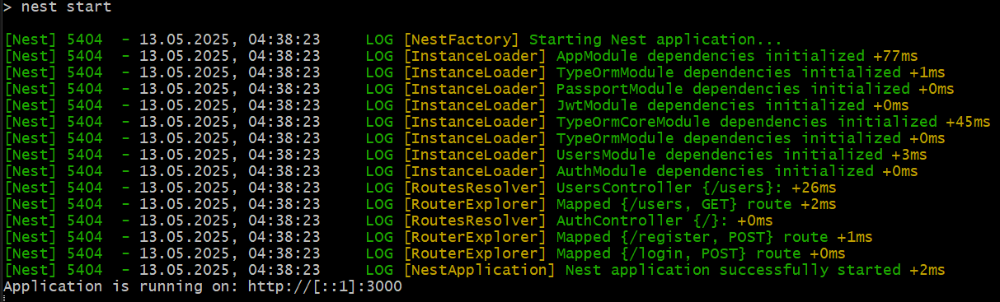
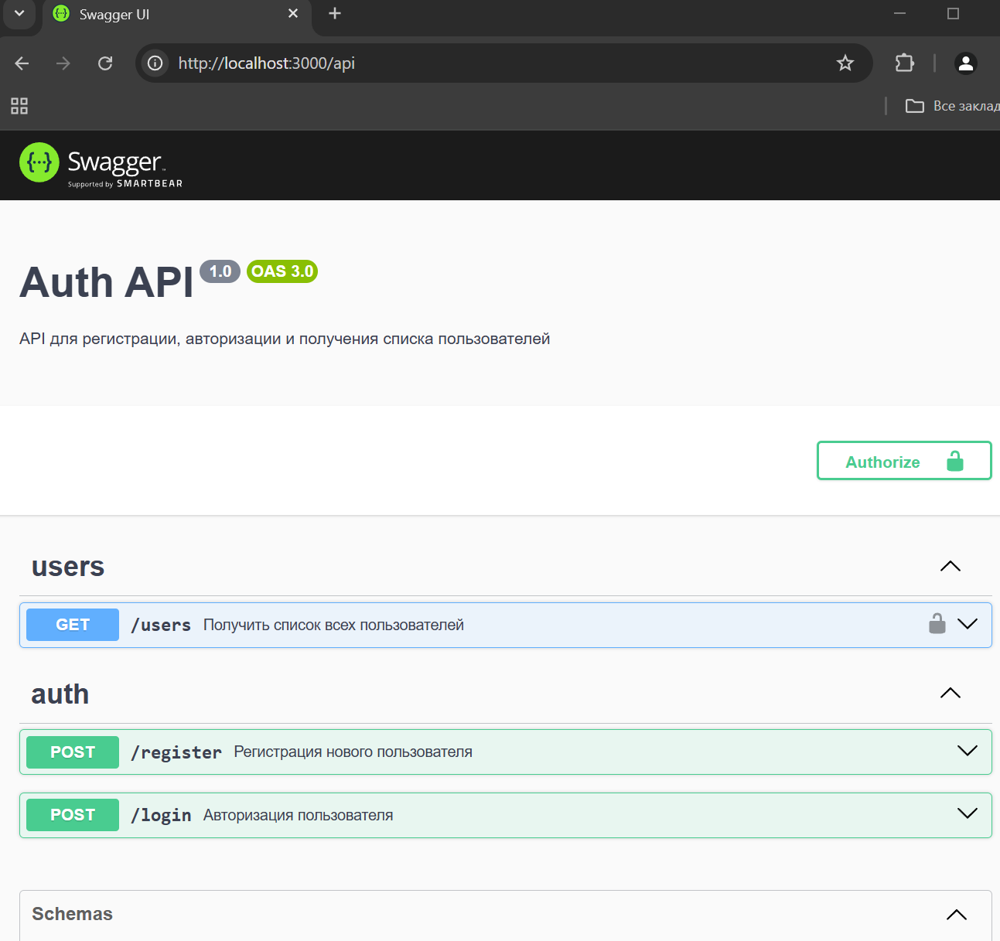
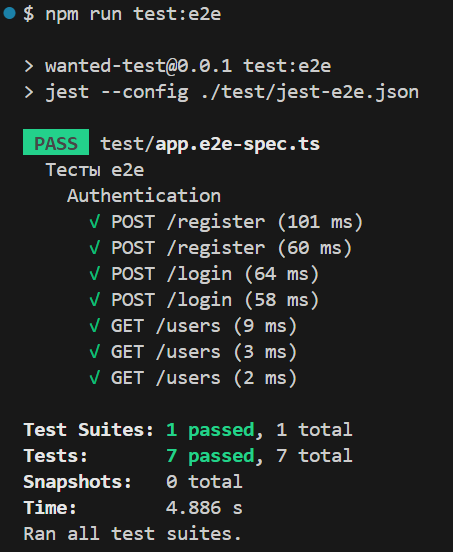

## Описание

Тестовое задание на позицию Fullstack Developer

## Реализовано

- Реализация API с 3 эндпоинтами:  
  1. POST /register – регистрация пользователя (email, пароль) без отправки валидационного письма на почту, просто сразу регистрируем
  2. POST /login – авторизация (возвращает JWT-токен)  
  3. GET /users – получение списка пользователей (только для авторизованных)  
- Хранение пользователей в базе данных (MongoDB, PostgreSQL)  
- Использование bcrypt для хеширования паролей  
- Авторизация через JWT (jsonwebtoken)  
- Развернуть Swagger с возможностью выполнения запросов

## Дополнительно

- Тесты e2e (Jest) 

## Что осталось за кадром?

- Докеризация бэкенда (хотя бд поднимается через docker-compose, но это не тот идеал, к которому нужно стремиться)

Плюс некоторые важные замечания отмечены в [Issues](https://github.com/Chupriarti/wanted-fullstack-test/issues) 

## Что необходимо для запуска проекта?

Устанавливаем зависимости:
```bash
npm install
```

Для работы с бд необходимо установить `docker`

Для подготовки Базы данных `PostgreSQL` нужно выполнить команду:

```bash
docker-compose up -d
```

Образ будет загружен и запущен согласно указанным в файле `docker-compose.yml` настройкам.

## Запуск и проверка проекта

Для запуска можно использовать (первый запуск занимает некоторое время - NestJS никуда не спешит)

```bash
npm run start
```

Приложение будет запущено и апи можно пощупать в swagger - [http://localhost:3000/api](http://localhost:3000/api) 

e2e тесты можно запустить командой 

```bash
npm run test:e2e
```

##Скриншоты
Запуск приложения

Swagger

Тесты (первый запуск)

